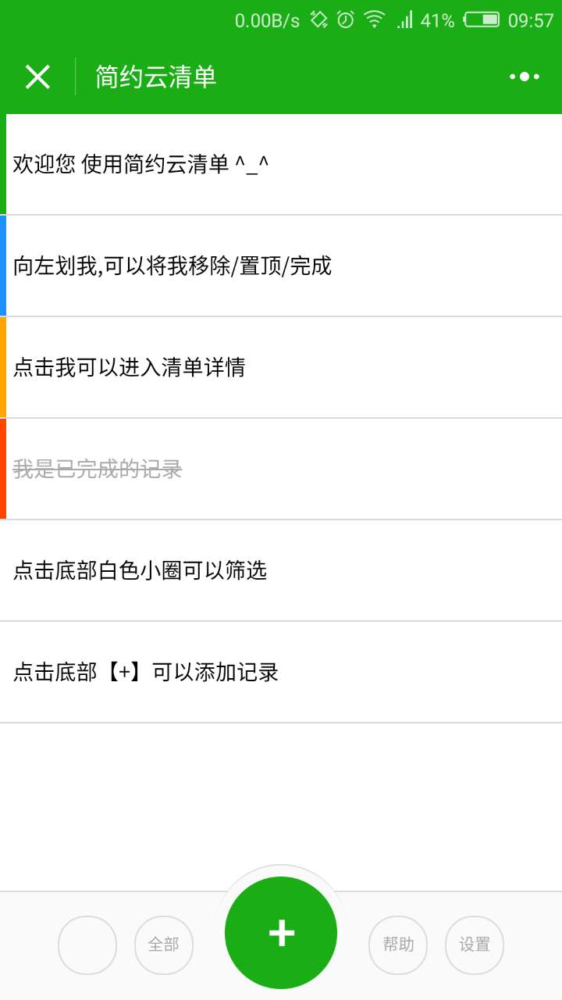

### 介绍
这是一个简单的一个计划清单小程序，可以在微信上搜索《简约云清单》便可以找到。  
  
扫码预览本小程序哦 ↑

### 技术支持
1. 参考微信小程序文档 https://mp.weixin.qq.com/debug/wxadoc/dev/api/  
2. 利用小程序接口wx.setStorage(OBJECT) 和 wx.getStorage(OBJECT)实现本地储存

### 已实现功能
- [x] 可以给清单item标记颜色
- [x] 可以在清单列表左划快捷操作
- [x] 可以对清单列表进行颜色、完成状态进行筛选

### 计划
- [ ] 开发后端程序实现云储存功能

### 效果

